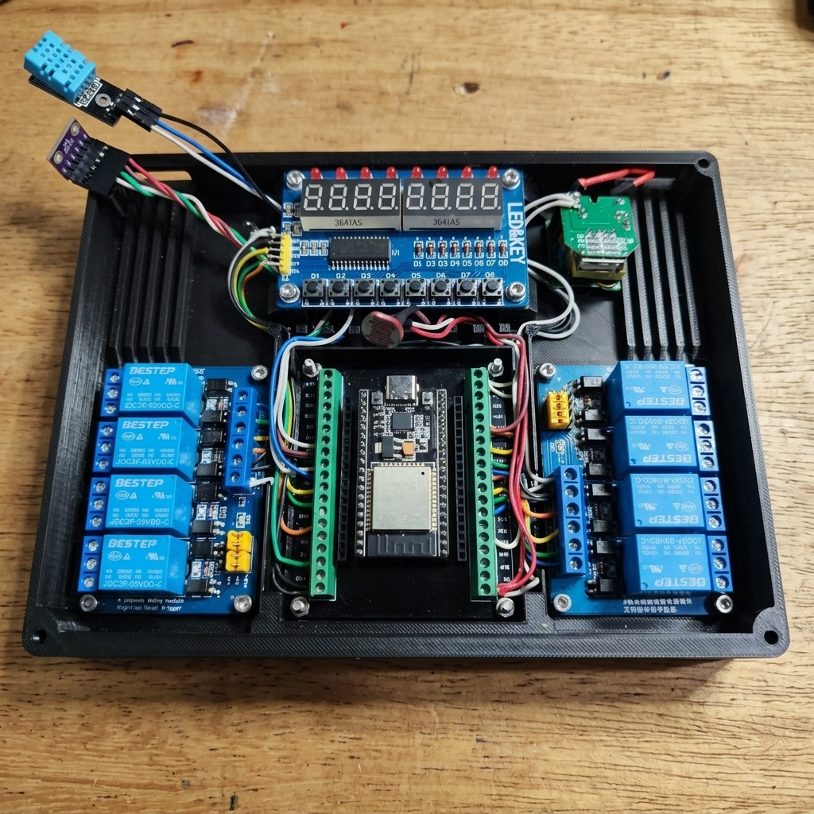
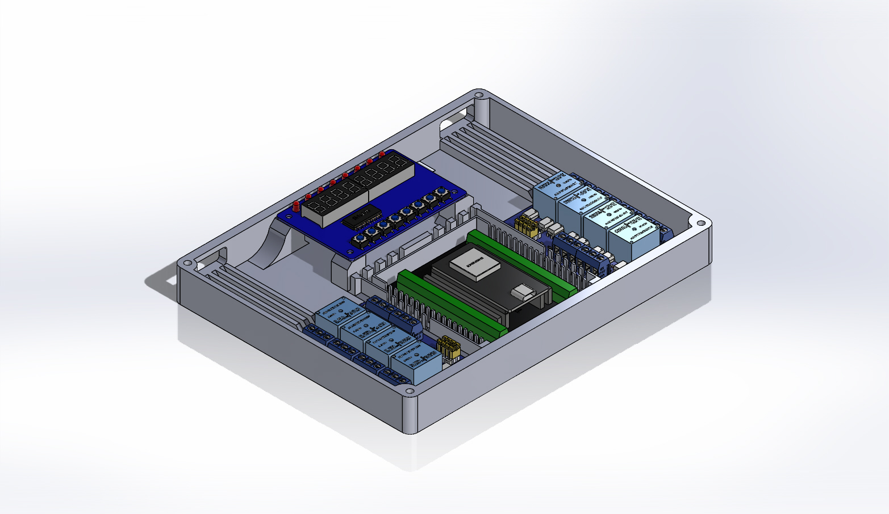
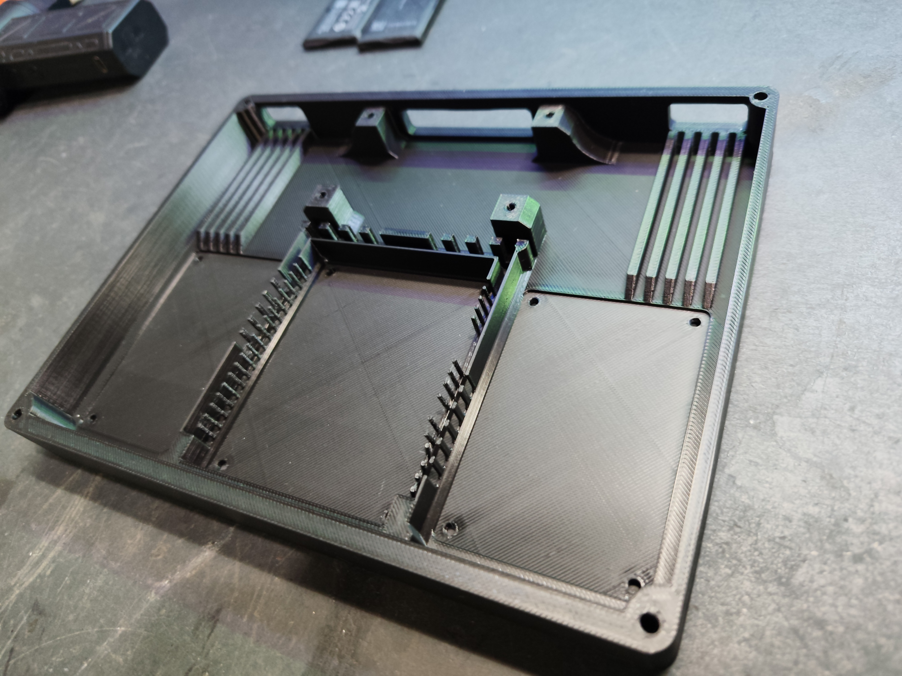
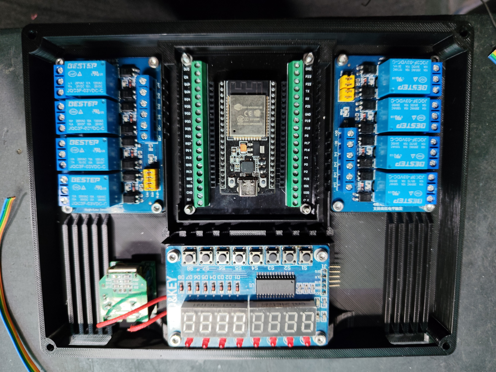

# W-LAB Smart Controller ⚡

A fully integrated, 3D-printed, open-source smart lab automation controller based on the ESP32.

This project transforms an ESP32 into a central command hub for an automation lab (or any workshop), bringing physical controls, sensor fusion, and cloud capabilities into a single beautifully 3D-printed case.

## 📱 Cloud, UI & Voice Control

### ESP RainMaker App

The system leverages ESP RainMaker for an instant, out-of-the-box mobile dashboard without any backend coding. It exposes all 8 relay channels and live sensor metrics.

### Google Home & Voice Commands

By securely linking your RainMaker account to Google Home (or Amazon Alexa), the controller seamlessly translates into native smart home devices. You can control the lab instantly using natural voice commands:
* *"Hey Google, turn on Channel 1"* (or whatever custom name you assign to the relay, e.g., *"turn on Soldering Iron"*).
* *"Hey Google, what's the Temperature in the Lab?"*

## 🚀 Features

*   **8-Channel Relay Control:** Independently control up to 8 high-voltage/high-current devices via physical buttons, RainMaker App, Google Home, or MQTT.
*   **TM1638 Control Panel:** Features a retro-industrial 7-segment display that acts as a "Carousel", rotating through live sensor data (`t`, `H`, `P`, `L`) every 3 seconds. The 8 buttons on the panel act as physical overrides for the 8 relays.
*   **Sensor Fusion (BMP280 + DHT11):** Calculates a highly accurate "Official Temperature" using a weighted average (80% BMP280, 20% DHT11). It also records Relative Humidity and Atmospheric Pressure.
*   **Luminosity Tracking (LDR):** A self-calibrated LDR circuit tracks ambient light from 0% (total darkness) to 100% (bright light).
*   **Parasitic Power Architecture:** Due to extreme pin constraints, the sensors are powered directly by ESP32 GPIO pins acting as fake 3.3V and GND rails.

## 🗜️ Hardware & CAD

The `/cad` directory contains the full SolidWorks assembly (`.SLDASM`, `.SLDPRT`) and ready-to-print `Box.STL` files. 

The custom 3D printed case features:
- Central mounting for an ESP32 DevKit V1 with screw-terminal breakout boards.
- Symmetric dual 4-channel relay mounts.
- Custom wire routing channels to keep high-voltage and low-voltage lines organized.
- Top mounting for the TM1638 display and LDR sensor.

## 🔌 Pinout & Wiring

**Warning on Boot Pins:** Do not use GPIO 0, 2, or 15 for sensors, as they are strapping pins and will cause boot failures.

### Relays (8 Channels)
*   Relay 1 to 8: `GPIO 13`, `12`, `14`, `27`, `26`, `25`, `33`, `32`

### TM1638 Display
*   STB: `GPIO 4`, CLK: `GPIO 18`, DIO: `GPIO 19`

### Sensors (I2C & Analog)
*   **I2C SDA (BMP280):** `GPIO 21` | **I2C SCL (BMP280):** `GPIO 22`
*   **LDR Signal:** `GPIO 34` (ADC1) | **LDR VCC & GND:** Physical pins

### Parasitic Power Rails (The "Hack")
*   **DHT11 Signal:** `GPIO 5`
*   **Shared Sensor GND:** `GPIO 16` (Driven LOW in setup)
*   **DHT11 VCC:** `GPIO 17` (Driven HIGH in setup)

## 📡 MQTT Integration (Home Assistant)

While RainMaker provides external cloud access, the W-LAB Smart Controller also features a fully independent **Local MQTT Client**. This ensures absolute reliability, privacy, and ultra-low latency integration with systems like **Home Assistant** or Node-RED, bypassing the cloud entirely for your local automations.

The controller publishes live, staggered telemetry data to the following topics:
*   `home_lab/sensor/temperature`
*   `home_lab/sensor/humidity`
*   `home_lab/sensor/pressure`
*   `home_lab/sensor/light`

It also subscribes to local command topics allowing external systems to control the relays:
*   `home_lab/ch[1-8]/set` (Payload: `ON`, `OFF`, `TOGGLE`)

And publishes its state feedback so Home Assistant switches stay perfectly in sync:
*   `home_lab/ch[1-8]/status` (Payload: `ON`, `OFF`)

## 🛠️ Usage

1. Open `src/Rainmaker_Final/Rainmaker_Final.ino` using the Arduino IDE.
2. Update your local Wi-Fi and MQTT Broker credentials in the source code.
3. Flash the code to the ESP32 (Requires ESP32 core v2.0.x).
4. Link your account to Google Home for seamless voice control.
5. Mount it on your wall and enjoy the clicking sounds of automation!
